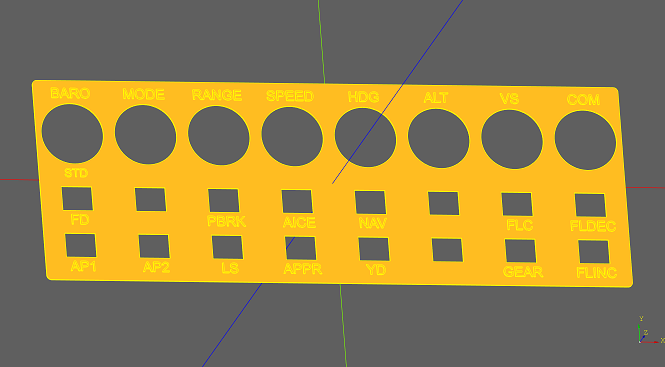

# Available 3D models for printing

For 3D printing download the .stl files.
* [RangeKnob.stl](./RangeKnob.stl)
* [SpeedKnob.stl](./SpeedKnob.stl)
* [HdgKnob.stl](./HdgKnob.stl)
* [AltKnob.stl](./AltKnob.stl)
* [xtouchLeft.stl](./xtouchLeft.stl)
* [xtouchRight.stl](./xtouchRight.stl)
* [xtouchTotal.stl](./xtouchTotal.stl)

   )

 



# How to change labels and create your own plate
The 3D model is created with [CadQuery](https://github.com/CadQuery/cadquery). CadQuery is a scripting language to create 3D models. 
* [Download](https://github.com/CadQuery/cadquery) and extract the free [CQ-editor](https://github.com/CadQuery/CQ-editor).  
* Download the [script files](./CadQuery)
* Start CQ-Editor with CQ-editor.cmd
* Open Script file in CQ-Editor
* Adjust topTexts or texts and press the green play button
* A new model is rendered and a model file is auto generated in the same directory as the script file.
* To only render comment out the line ```cq.exporters.export(r,... ``` with a leading # 
* To create a model with 8 columns, just set ```xCount = 8``` and fill all texts.


# How to modify the knobs
The knobs are created with [FreeCad v0.19](https://github.com/FreeCAD/FreeCAD). The CAD models are supplied [here](./FreeCad).

Export from FreeCad as .stl:
* Open “Mesh Design” Workbench
* Meshes → Create mesh from shape
     * Mefisto → Maximum edge length: 0,25mm
* Meshes → Export Mesh
