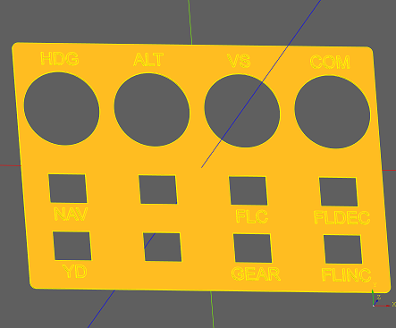

# Available 3D models for printing

   )

 

# Change labels and create your own plate
The 3D model is created with [CadQuery](https://github.com/CadQuery/cadquery). CadQuery is a scripting language to create 3D models. 
* [Download](https://github.com/CadQuery/cadquery) and extract the free [CQ-editor](https://github.com/CadQuery/CQ-editor).  
* [Download](./CadQuery) the script files
* Start CQ-Editor with CQ-editor.cmd
* Open Script file in CQ-Editor
* Adjust topTexts or texts and press the green play button
* Now a new model is rendered and a model file auto generated in the same directory as the script file.
* To only render comment out the line ```cq.exporters.export(r,... ``` with a leading # 


# Modify the knobs
The knobs are created with [FreeCad v0,19](https://github.com/FreeCAD/FreeCAD). The CAD models are supplied [here](./FreeCad).
