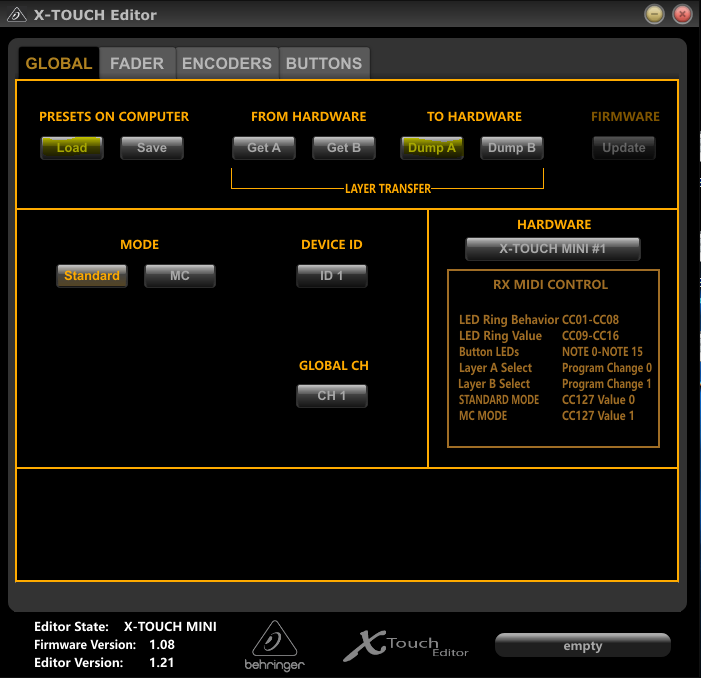
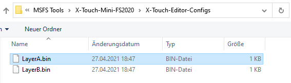

# MSFSxTouchMini
Installation and Configuration of Behringer X-Touch Mini for Microsoft Flight Simulator. Including configuration for the FlyByWire A320 and 3D printable labels.

## Overview

Needed Software:
* [X-Touch-Mini-FS2020](https://github.com/maartentamboer/X-Touch-Mini-FS2020): 
  * Needs to run while the flighsim is running. This software is the communication bridge between the X-Touch Mini and the flighsim. It converts the midi signals to the flightsim simconnect interface.
* [Mobiflight Addon](https://www.mobiflight.com/en/download.html):
  * Mobiflight installs an addon to the community folder. This exposes special variables to the simconnect interface and makes them accessible for other external software like the X-Touch-Mini-FS2020.
* [Behringer X-Touch Editor](https://www.behringer.com/product.html?modelCode=P0B3M):
  * That is needed to make a configuration change to the dial knobs.

## Installation and setup

### Make configuration change to Behringer X-Touch Mini

This needs only to be done once.

* Download [X-Touch-Mini-FS2020](https://github.com/maartentamboer/X-Touch-Mini-FS2020/releases). Extract zip and save software in a folder.
* Download X-Touch Editor from [Behringer Website](https://www.behringer.com/product.html?modelCode=P0B3M). Software -> Editor for Windows V1.21. Or try this direct [Link](https://www.behringer.com/product.html?modelCode=P0B3M).
* Make sure your X-Touch mini is connected to the PC
* Start X-Touch Editor with X-TOUCH.exe
*  
* Load configuration A from X-Touch-Mini-FS2020 and save it on your X-Touch mini
  * PRESETS ON COMPUTER -> Load
  * Select LayerA.bin from X-Toch-Editor-Configs in your X-Touch-Mini-FS2020 folder.
  *  
  * TO HARDWARE -> Dump A 
* Repeat the same for configuration B. Load LayerB.bin and Dump B.
