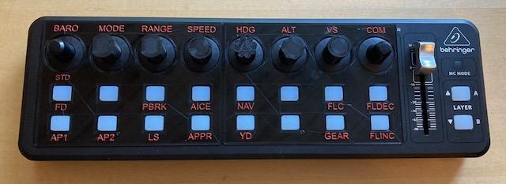
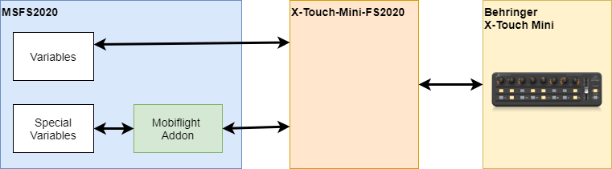

# MSFSxTouchMini
Installation and Configuration of Behringer X-Touch Mini for Microsoft Flight Simulator. Including configuration for the FlyByWire A320 and 3D printable labels.

## 3D models for printing
* [3D models for printing](3dmodels/README.md)

## Overview

Needed Software:
* [X-Touch-Mini-FS2020](https://github.com/maartentamboer/X-Touch-Mini-FS2020): 
  * Needs to run while the flighsim is running. This software is the communication bridge between the X-Touch Mini and the flighsim. It converts the midi signals to the flightsim simconnect interface.
* [Mobiflight Addon](https://www.mobiflight.com):
  * Mobiflight installs an addon to the community folder. This exposes special variables to the simconnect interface and makes them accessible for other external software like the X-Touch-Mini-FS2020.
* [Behringer X-Touch Editor](https://www.behringer.com/product.html?modelCode=P0B3M):
  * That is needed to make a configuration change to the dial knobs.

## Installation and setup
Follow those steps:
* [Installation and setup](installation/README.md)

## Configuration of buttons and knobs

Configuration is done via the files in X-Touch-Mini-FS2020\Configurations

* [Configuration for FlyByWire A320 Dev Version](Configurations/README.MD)

## Usage

* Connect the X-Touch mini via USB
* After the start of MSFS2020 start X-Touch_mini-FS2020.exe. The button and knobs layout changes automatically for different planes according to the configuration.
   * (X-Touch Editor must not run at the same time)  

