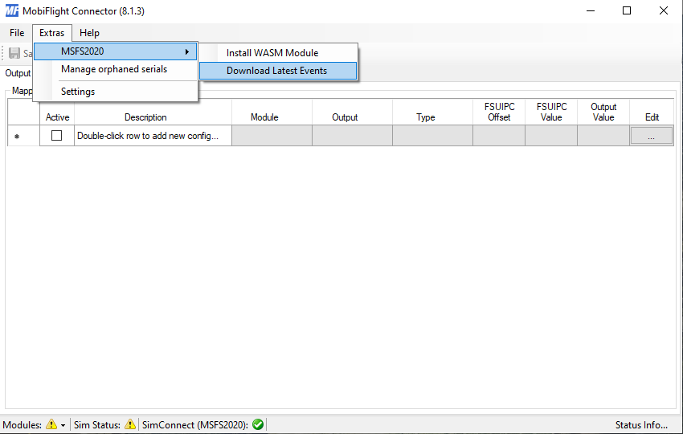

# MSFSxTouchMini
Installation and Configuration of Behringer X-Touch Mini for Microsoft Flight Simulator. Including configuration for the FlyByWire A320 and 3D printable labels.

## Overview

Needed Software:
* [X-Touch-Mini-FS2020](https://github.com/maartentamboer/X-Touch-Mini-FS2020): 
  * Needs to run while the flighsim is running. This software is the communication bridge between the X-Touch Mini and the flighsim. It converts the midi signals to the flightsim simconnect interface.
* [Mobiflight Addon](https://www.mobiflight.com):
  * Mobiflight installs an addon to the community folder. This exposes special variables to the simconnect interface and makes them accessible for other external software like the X-Touch-Mini-FS2020.
* [Behringer X-Touch Editor](https://www.behringer.com/product.html?modelCode=P0B3M):
  * That is needed to make a configuration change to the dial knobs.

## Installation and setup

### Make configuration change to Behringer X-Touch Mini

This needs only to be done once.

* Download [X-Touch-Mini-FS2020](https://github.com/maartentamboer/X-Touch-Mini-FS2020/releases). Extract zip and save software in a folder.
* Download X-Touch Editor from [Behringer Website](https://www.behringer.com/product.html?modelCode=P0B3M). Software -> Editor for Windows V1.21. Or try this direct [Link](https://www.behringer.com/product.html?modelCode=P0B3M).
* Make sure your X-Touch mini is connected to the PC
* Start X-Touch Editor with X-TOUCH.exe
*  
* Load configuration A from X-Touch-Mini-FS2020 and save it on your X-Touch mini
  * PRESETS ON COMPUTER -> Load
  * Select LayerA.bin from X-Tooch-Editor-Configs in your X-Touch-Mini-FS2020 folder.
  *  
  * TO HARDWARE -> Dump A 
* Repeat the same for configuration B. Load LayerB.bin and Dump B.

### Install MobiFlight addon

* Download MobiFlightConnector-8.0.2.9.zip from [Mobiflight](https://bitbucket.org/mobiflight/mobiflightfc/downloads/). Extract zip and save software in a folder.
* Run MFConnector.exe from Mobiflight folder. 
* Execute: Extras -> MSFS2020 -> Install WASM Module
* Execute: Extras -> MSFS2020 -> Download Latest Events
*  
* Now there is the Mobiflight addon in the flightsim Community folder.

## Configuration of buttons and knobs

Configuration is done via the files in X-Touch-Mini-FS2020\Configurations

## Usage

After the start of MSFS2020 start X-Touch_mini-FS2020.exe. The button and knobs layout changes automatically for different planes according to the configuration.

### Default configuration of X-Touch-Mini-FS2020:

**Knobs**
* Knob1 - Heading bug
* Knob2 - Baro
* Knob3 - Alt bug
* Knob4 - VS bug
* Knob5 - COM
* Knob6 - NAV1

**ROW 1**
* Button1 - Flight Director
* Button2 - HDG
* Button3 - ALT
* Button4 - VS
* Button5 - APR
* Button6 
* Button7
* Button8 - Decrease Flaps

**ROW 2**
* Button9 - AP
* Button10 - NAV
* Button11
* Button12 - AP flight level change
* Button13 - YD
* Button14 - Master Battery
* Button15 - Gear
* Button16 - Increase Flaps
